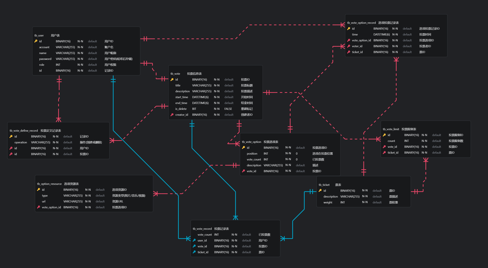

<center><h1>数据库课程设计实验报告</h1></center>

<center>162220223-冼俊杰</center>

## 1 项目简介
本项目是一个基于Spring Boot的投票系统，旨在提供一个简单易用的在线投票平台。用户可以注册、登录、创建投票、参与投票，并查看投票结果。系统采用前后端分离的架构，前端采用HTML、CSS和JavaScript实现，后端使用Spring Boot框架。
数据库使用MySQL存储用户信息和投票数据，并且在后端利用``Spring Data JPA``进行数据访问。

## 2 需求分析

### 2.1 用户注册与登录
投票系统的功能是统计用户的投票结果，因此需要提供以下和用户相关的功能：
+ 用户注册与登录的功能
+ 用户信息的修改与删除
+ 用户的权限控制
+ 用户的鉴权与身份认证

### 2.2 投票创建与检索
投票系统需要支持用户创建投票和检索投票的功能，具体包括：
+ 创建投票的功能
    + 投票标题、描述、选项等信息
    + 投票的开始和结束时间
    + 投票的状态（进行中、已结束等）
    + 投票的选项内容，包含文字和图片信息
    + 投票可投的票数以及票的种类
+ 检索投票的功能
    + 显示所有投票信息
    + 支持关键字搜索投票
    + 支持检索用户创建的投票

### 2.3 投票数据存储与统计
投票系统需要对用户创建的投票以及用户参与的投票进行数据存储和统计，具体包括：
+ 投票数据的存储
    + 投票选项的统计
    + 投票结果的展示
+ 投票数据的统计
    + 投票的选项得票数
    + 投票的总票数

### 2.4 用户访问控制
投票系统需要对用户进行相应的访问控制，即不同的用户无法访问或修改其他用户的投票数据。同时用户也无法冒充其他用户进行投票行为。
并且为了方便投票的管理，需要提供管理员权限的用户可以对所有投票进行管理，包括删除、修改等操作。

### 2.5 用户界面可视化
投票系统需要提供一个友好的用户界面，方便用户进行投票操作。具体包括：
+ 登录注册页面，用户可以在该页面中注册新用户或登录已有用户。
+ 首页，显示所有投票信息，包括投票标题、创建者、创建时间、投票状态等，方便用户浏览和参与投票。
+ 投票详情页，显示投票的详细信息，包括投票选项、投票结果等，用户可以在该页面中参与投票。
+ 创建投票页面，用户可以在该页面中创建新的投票，填写投票标题、描述、选项等信息。
+ 投票记录页面，用户可以查看自己参与过的投票记录，包括投票结果和投票时间等信息。

## 3 系统设计

### 3.1 数据库设计

#### 3.1.1 实体关系模型(E-R图)
根据上述需求分析，设计以下实体关系模型(E-R图)：

#### 3.1.2 数据库表结构设计
根据上述的需求分析，与E-R图设计，设计以下数据库表结构：

##### 3.1.2.1 用户表(tb_user)
根据需求分析，可以设计用户表以存储对应的数据信息
+ 用户注册登录需求：
    + 用户名、密码信息
    + 用户权限（普通用户或管理员）
+ 用户信息修改与删除需求：
    + 用户昵称等信息
因此设计用户表(tb_user)如下：

```sql
create table if not exists vote_system.tb_user
(
    id       binary(16)             not null
        primary key,
    account  varchar(255)           not null,
    name     varchar(255)           not null,
    password varchar(255)           not null,
    role     enum ('ADMIN', 'USER') not null,
    constraint UK5v0cvlqtspx9cs9qhhpqjne90
        unique (account)
);
```

##### 3.1.2.2 投票表(tb_vote)
根据需求分析，可以设计投票表以存储对应的数据信息
+ 投票创建与检索需求：
    + 投票标题、描述、选项等信息
    + 投票的开始和结束时间
    + 投票可用的票数以及票的种类
    + 投票是否被删除
因此设计投票表(tb_vote)如下：
```sql
create table if not exists vote_system.tb_vote
(
    is_delete   bit          not null,
    end_time    datetime(6)  not null,
    start_time  datetime(6)  not null,
    creator_id  binary(16)   not null,
    id          binary(16)   not null
        primary key,
    description varchar(255) not null,
    title       varchar(255) not null,
    constraint FKb0njb1pqvgogh53g4kods8j77
        foreign key (creator_id) references vote_system.tb_user (id)
);
```
##### 3.1.2.3 投票选项表(tb_vote_option)
根据需求分析，可以设计投票选项表以存储对应的数据信息
+ 投票创建与检索需求：
    + 投票选项内容，包含文字和图片信息
    + 投票选项的得票数
    + 投票选项所属的投票
因此设计投票选项表(tb_vote_option)如下：
```sql
create table if not exists vote_system.tb_vote_option
(
    position    int          null,
    vote_count  int          null,
    id          binary(16)   not null
        primary key,
    vote_id     binary(16)   null,
    description varchar(255) null,
    constraint FKnni9i6g97ug9egsfw6n01titi
        foreign key (vote_id) references vote_system.tb_vote (id)
);
```

##### 3.1.2.4 投票记录表(tb_vote_record)
根据需求分析，可以设计投票记录表以存储对应的数据信息
+ 用户投票记录需求：
    + 用户参与的投票记录
    + 投票的种类
    + 投票的选项
    + 投票时间
因此设计投票记录表(tb_vote_record)如下：

```sql
create table if not exists vote_system.tb_vote_option_record
(
    time           datetime(6) not null,
    id             binary(16)  not null
        primary key,
    ticket_id      binary(16)  not null,
    vote_option_id binary(16)  not null,
    voter_id       binary(16)  not null,
    constraint FKeiu3psf17t6pjovsdhfh4ak06
        foreign key (ticket_id) references vote_system.tb_ticket (id),
    constraint FKrh0mhiwmrs2vqpbrjxqokjmgk
        foreign key (vote_option_id) references vote_system.tb_vote_option (id),
    constraint FKsmq0tk6qlq6jetskk8yi1wxom
        foreign key (voter_id) references vote_system.tb_user (id)
);
```

##### 3.1.2.5 投票票据表(tb_ticket)
根据需求分析，可以设计投票票据表以存储对应的数据信息
+ 投票票据的多样化需求：
    + 投票票据的种类描述
    + 投票票据的权重
因此设计投票票据表(tb_ticket)如下：
```sql
create table if not exists vote_system.tb_ticket
(
    weight      int          not null,
    id          binary(16)   not null
        primary key,
    description varchar(255) not null
);
```

##### 3.1.2.6 投票选项图片表(tb_option_resource)
根据需求分析，可以设计投票选项资源表来存储投票选项的对应资源信息
+ 投票选项的资源信息
    + 投票选项的资源定位
    + 投票选项的资源类型
因此设计投票选项资源表(tb_option_resource)如下：
```sql
create table if not exists vote_system.tb_option_resource
(
    id             binary(16)   not null
        primary key,
    vote_option_id binary(16)   null,
    type           varchar(255) null,
    url            varchar(255) null,
    constraint FKi78hentqckxnca62l670wjegw
        foreign key (vote_option_id) references vote_system.tb_vote_option (id)
);
```

##### 3.1.2.7 投票票据限制表(tb_ticket_limit)
根据需求分析，每个投票都需要限定用户可以投的票数，因此需要设计投票票据限制表来存储对应的数据信息
+ 投票票据的限制信息
    + 投票的可用票数
    + 投票的可用票种类
    + 对应的投票
因此设计投票票据限制表(tb_ticket_limit)如下：

```sql
create table if not exists vote_system.tb_vote_limit
(
    count     int        not null,
    id        binary(16) not null
        primary key,
    ticket_id binary(16) not null,
    vote_id   binary(16) not null,
    constraint FKfbetel10jqfkev74na2yieqxe
        foreign key (ticket_id) references vote_system.tb_ticket (id),
    constraint FKs8a70sh7hj787b5oklir2tqa2
        foreign key (vote_id) references vote_system.tb_vote (id)
);
```

##### 3.1.2.8 投票记录表(tb_vote_record)
根据需求分析，可以设计投票记录表来存储用户的投票记录信息。
此表是为了加速查询投票记录而设计的，如果利用投票选项表(tb_vote_option)和投票记录表(tb_vote_record)进行查询，
联合与聚合操作会导致查询效率低下，因此设计此表来存储用户的投票记录信息。

同时为了加速查询，本表的主键设置为复合主键，由投票票据ID、投票选项ID和投票用户ID组成。

+ 用户投票记录需求：
    + 用户参与的投票记录
    + 投票的种类
    + 投票的选项
    + 投票次数
因此设计投票记录表(tb_vote_record)如下：
```sql
create table if not exists vote_system.tb_vote_record
(
    vote_count int        not null,
    ticket_id  binary(16) not null,
    user_id    binary(16) not null,
    vote_id    binary(16) not null,
    primary key (ticket_id, user_id, vote_id),
    constraint FKb2arux0n0c9hp4l9mrshyvkvg
        foreign key (ticket_id) references vote_system.tb_ticket (id),
    constraint FKj1rlo6wtl6qibjq8an1qj0ucl
        foreign key (user_id) references vote_system.tb_user (id),
    constraint FKs12eos24tbytguaus90j4igbw
        foreign key (vote_id) references vote_system.tb_vote (id)
);
```

##### 3.1.2.9 投票定义记录表(tb_vote_define_record)
根据管理的需求分析，可以设计投票定义记录表来存储用户对投票的创建和修改记录信息。
+ 投票定义记录需求：
    + 投票的创建和修改记录
    + 投票的创建和修改时间
    + 投票的创建和修改用户
    + 进行操作
因此设计投票定义记录表(tb_vote_define_record)如下：
```sql
create table if not exists vote_system.tb_vote_define_record
(
    time      datetime(6)  not null,
    id        binary(16)   not null
        primary key,
    user_id   binary(16)   null,
    vote_id   binary(16)   null,
    operation varchar(255) not null,
    constraint FKss0317x3rrh3uxnvyuy2gegyk
        foreign key (vote_id) references vote_system.tb_vote (id),
    constraint FKt3166ta8wx2yjmoel2anxo9l7
        foreign key (user_id) references vote_system.tb_user (id)
);
```

#### 3.1.3 实体完整性与参照完整性设计

##### 3.1.3.1 实体完整性
根据上述的需求分析以及所实现的数据库表结构，可以看出每个表的主键都被设置为非空且唯一，因此满足实体完整性要求。

##### 3.1.3.2 参照完整性
上述的数据库表结构中，所有的外键都被设置为非空且引用了其他表的主键，因此满足参照完整性要求。

#### 3.1.4 数据索引设计
为了加速查询操作，在常用的表结构中添加了索引。

##### 3.1.4.1 用户表(tb_user)
由于用户表(tb_user)中的账号字段(account)是唯一的，同时在注册时用户尚未分配ID，因此在账号字段上添加唯一索引，以加速用户登录和注册操作。
```sql
create index account
    on vote_system.tb_user (account);
```
此索引可以加速用户相关操作，对用户的查询、登录和注册等操作提供了更快的响应速度。

##### 3.1.4.2 投票限制表(tb_vote_limit)
由于投票限制表(tb_vote_limit)中的投票ID(vote_id)和票据ID(ticket_id)是外键，并且在查询投票限制时需要根据投票ID和票据ID进行查询，因此在这两个字段上添加联合索引，以加速查询操作。
```sql
create index idx_vote_ticket
    on vote_system.tb_vote_limit (vote_id, ticket_id);
```

##### 3.1.4.3 投票选项资源表(tb_option_resource)
由于投票选项资源表(tb_option_resource)中的投票选项ID(vote_option_id)是外键，并且在查询投票选项资源时需要根据投票选项ID进行查询，因此在该字段上添加索引，以加速查询操作。
```sql
create index idx_option_resource_vote_option_id
    on vote_system.tb_option_resource (vote_option_id);
```

##### 3.1.4.4  投票选项记录表(tb_vote_option_record)
由于需要对用户所进行的投票记录进行展示，所以需要根据用户进行查询，因此在投票选项记录表(tb_vote_option_record)中的用户ID(voter_id)上添加索引，以加速查询操作。
```sql
create index idx_user_vote
    on vote_system.tb_vote_option_record (voter_id);
```

#### 3.1.5 事务设计
由于本项目是一个线上投票系统，涉及到用户注册、登录、投票等操作，因此需要设计事务来保证数据的一致性和完整性。
对于只读

### 3.2 软件架构设计

#### 3.2.1 前端页面设计

#### 3.2.2 后端接口层设计

#### 3.2.3 后端服务层设计

#### 3.2.4 后端数据访问层设计

## 4 功能实现

### 4.1 关键代码实现

### 4.2 数据处理逻辑

## 5 功能展示

### 5.1 前端页面展示

### 5.2 接口功能展示

### 5.3 数据库相关操作展示

## 6 总结