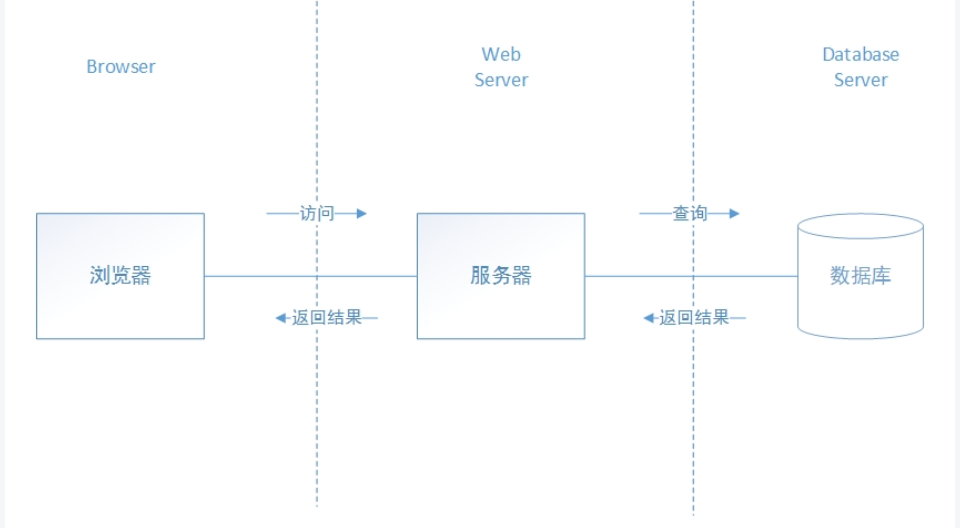
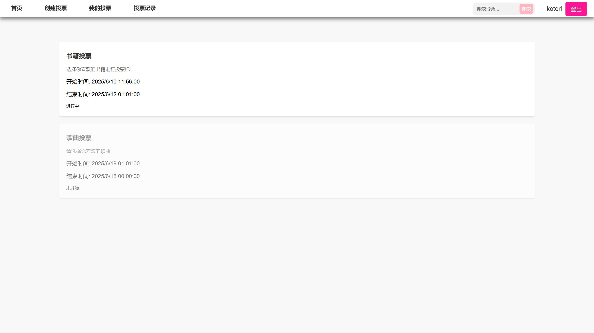
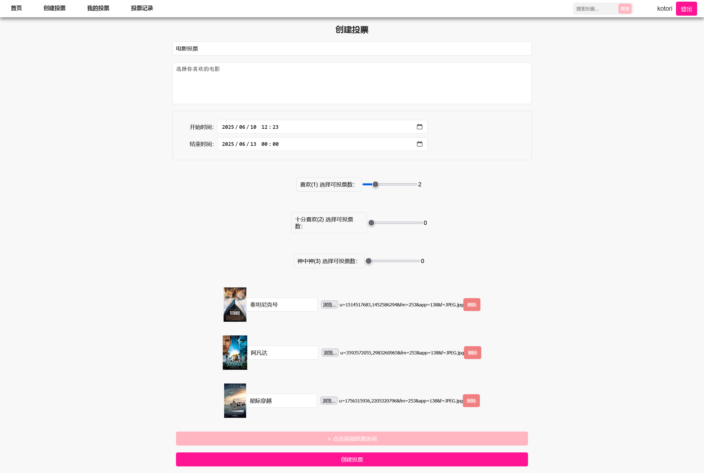
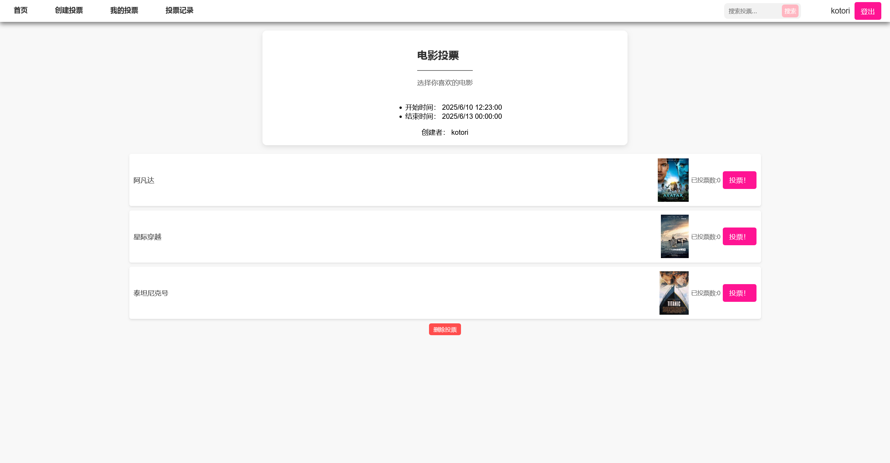
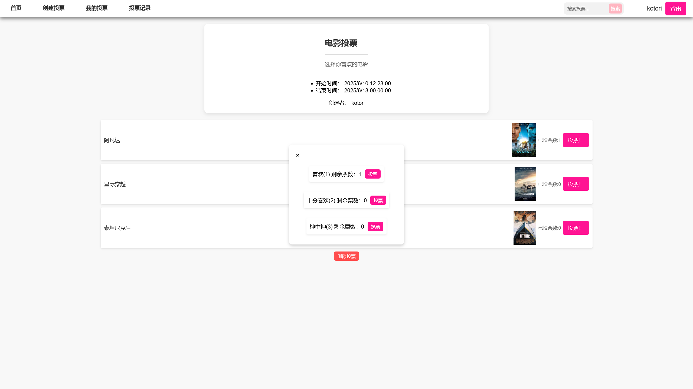
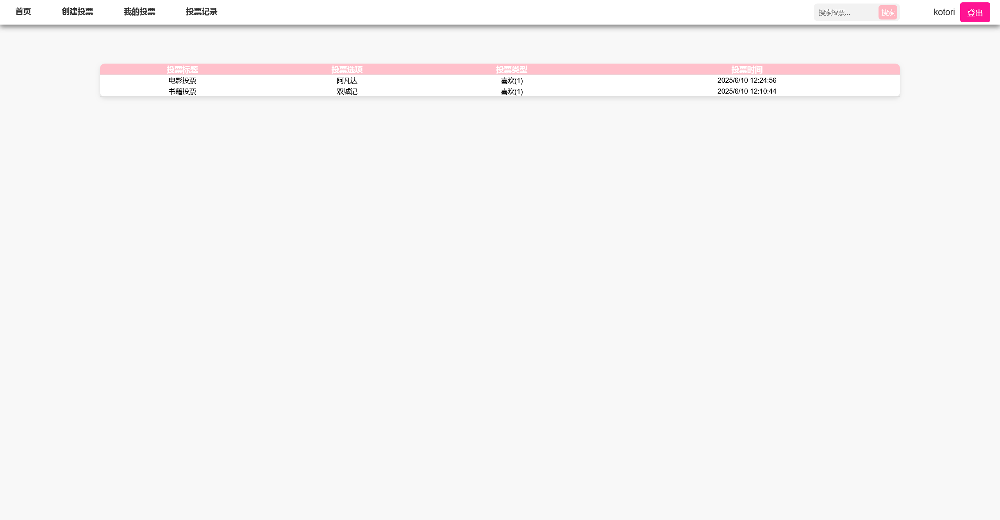
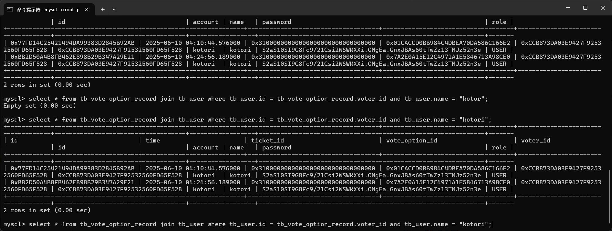
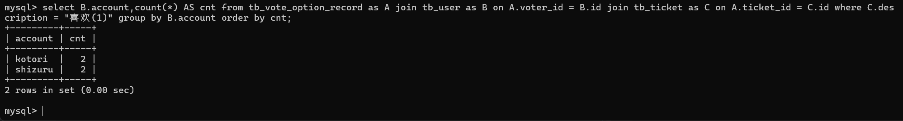
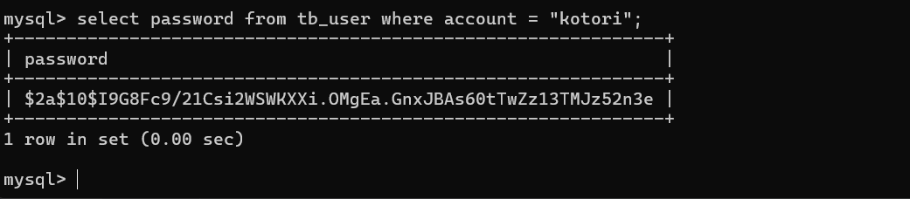
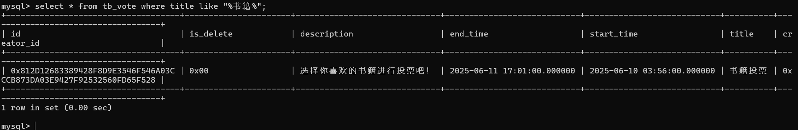

<center><h1>数据库课程设计实验报告</h1></center>

<center>162220223-冼俊杰</center>

## 1 项目简介
本项目是一个基于Spring Boot的投票系统，旨在提供一个简单易用的在线投票平台。用户可以注册、登录、创建投票、参与投票，并查看投票结果。系统采用前后端分离的架构，前端采用HTML、CSS和JavaScript实现，后端使用Spring Boot框架。
数据库使用MySQL存储用户信息和投票数据，并且在后端利用``Spring Data JPA``进行数据访问。

## 2 需求分析

### 2.1 用户注册与登录
投票系统的功能是统计用户的投票结果，因此需要提供以下和用户相关的功能：
+ 用户注册与登录的功能
+ 用户信息的修改与删除
+ 用户的权限控制
+ 用户的鉴权与身份认证

### 2.2 投票创建与检索
投票系统需要支持用户创建投票和检索投票的功能，具体包括：
+ 创建投票的功能
    + 投票标题、描述、选项等信息
    + 投票的开始和结束时间
    + 投票的状态（进行中、已结束等）
    + 投票的选项内容，包含文字和图片信息
    + 投票可投的票数以及票的种类
+ 检索投票的功能
    + 显示所有投票信息
    + 支持关键字搜索投票
    + 支持检索用户创建的投票

### 2.3 投票数据存储与统计
投票系统需要对用户创建的投票以及用户参与的投票进行数据存储和统计，具体包括：
+ 投票数据的存储
    + 投票选项的统计
    + 投票结果的展示
+ 投票数据的统计
    + 投票的选项得票数
    + 投票的总票数

### 2.4 用户访问控制
投票系统需要对用户进行相应的访问控制，即不同的用户无法访问或修改其他用户的投票数据。同时用户也无法冒充其他用户进行投票行为。
并且为了方便投票的管理，需要提供管理员权限的用户可以对所有投票进行管理，包括删除、修改等操作。

### 2.5 用户身份验证
由于投票系统是基于B/S架构，因此用户的请求是无状态的，为了防止非法的请求行为，需要在受保护的页面或者请求中对用户进行身份验证。
本系统采用的是``JWT``（JSON Web Token）进行用户身份验证，具体包括：
+ 在用户登录时生成一个JWT令牌，存储在后端的临时哈希容器中，并返回令牌给前端。
+ 前端获取令牌后，后续在必要的请求中携带该令牌。
+ 后端在请求中解析JWT令牌，验证令牌的合法性和有效性，以实现用户身份识。
+ 当用户登出后，删除前端的令牌存储，同时删除后端的令牌存储，防止重放攻击.

### 2.6 用户界面可视化
投票系统需要提供一个友好的用户界面，方便用户进行投票操作。具体包括：
+ 登录注册页面，用户可以在该页面中注册新用户或登录已有用户。
+ 首页，显示所有投票信息，包括投票标题、创建者、创建时间、投票状态等，方便用户浏览和参与投票。
+ 投票详情页，显示投票的详细信息，包括投票选项、投票结果等，用户可以在该页面中参与投票。
+ 创建投票页面，用户可以在该页面中创建新的投票，填写投票标题、描述、选项等信息。
+ 投票记录页面，用户可以查看自己参与过的投票记录，包括投票结果和投票时间等信息。

## 3 系统设计

### 3.1 系统架构设计
本项目采用前后端分离的``B/S``架构，前端使用``HTML + CSS + JavaScript``实现，后端使用``Spring Boot``框架。
数据库使用``MySQL``存储用户信息和投票数据，并且在后端利用``Spring Data JPA``进行数据访问。


### 3.2 数据库设计
#### 3.2.1 实体关系模型(E-R图)
根据上述需求分析，设计以下实体关系模型(E-R图)：

#### 3.2.2 数据库表结构设计
根据上述的需求分析，与E-R图设计，设计以下数据库表结构：

##### 3.2.2.1 用户表(tb_user)
根据需求分析，可以设计用户表以存储对应的数据信息
+ 用户注册登录需求：
    + 用户名、密码信息
    + 用户权限（普通用户或管理员）
+ 用户信息修改与删除需求：
    + 用户昵称等信息
因此设计用户表(tb_user)如下：

```sql
create table if not exists vote_system.tb_user
(
    id       binary(16)             not null
        primary key,
    account  varchar(255)           not null,
    name     varchar(255)           not null,
    password varchar(255)           not null,
    role     enum ('ADMIN', 'USER') not null,
    constraint UK5v0cvlqtspx9cs9qhhpqjne90
        unique (account)
);
```

##### 3.2.2.2 投票表(tb_vote)
根据需求分析，可以设计投票表以存储对应的数据信息
+ 投票创建与检索需求：
    + 投票标题、描述、选项等信息
    + 投票的开始和结束时间
    + 投票可用的票数以及票的种类
    + 投票是否被删除
因此设计投票表(tb_vote)如下：
```sql
create table if not exists vote_system.tb_vote
(
    is_delete   bit          not null,
    end_time    datetime(6)  not null,
    start_time  datetime(6)  not null,
    creator_id  binary(16)   not null,
    id          binary(16)   not null
        primary key,
    description varchar(255) not null,
    title       varchar(255) not null,
    constraint FKb0njb1pqvgogh53g4kods8j77
        foreign key (creator_id) references vote_system.tb_user (id)
);
```
##### 3.2.2.3 投票选项表(tb_vote_option)
根据需求分析，可以设计投票选项表以存储对应的数据信息
+ 投票创建与检索需求：
    + 投票选项内容，包含文字和图片信息
    + 投票选项的得票数
    + 投票选项所属的投票
因此设计投票选项表(tb_vote_option)如下：
```sql
create table if not exists vote_system.tb_vote_option
(
    position    int          null,
    vote_count  int          null,
    id          binary(16)   not null
        primary key,
    vote_id     binary(16)   null,
    description varchar(255) null,
    constraint FKnni9i6g97ug9egsfw6n01titi
        foreign key (vote_id) references vote_system.tb_vote (id)
);
```

##### 3.2.2.4 投票记录表(tb_vote_record)
根据需求分析，可以设计投票记录表以存储对应的数据信息
+ 用户投票记录需求：
    + 用户参与的投票记录
    + 投票的种类
    + 投票的选项
    + 投票时间
因此设计投票记录表(tb_vote_record)如下：

```sql
create table if not exists vote_system.tb_vote_option_record
(
    time           datetime(6) not null,
    id             binary(16)  not null
        primary key,
    ticket_id      binary(16)  not null,
    vote_option_id binary(16)  not null,
    voter_id       binary(16)  not null,
    constraint FKeiu3psf17t6pjovsdhfh4ak06
        foreign key (ticket_id) references vote_system.tb_ticket (id),
    constraint FKrh0mhiwmrs2vqpbrjxqokjmgk
        foreign key (vote_option_id) references vote_system.tb_vote_option (id),
    constraint FKsmq0tk6qlq6jetskk8yi1wxom
        foreign key (voter_id) references vote_system.tb_user (id)
);
```

##### 3.2.2.5 投票票据表(tb_ticket)
根据需求分析，可以设计投票票据表以存储对应的数据信息
+ 投票票据的多样化需求：
    + 投票票据的种类描述
    + 投票票据的权重
因此设计投票票据表(tb_ticket)如下：
```sql
create table if not exists vote_system.tb_ticket
(
    weight      int          not null,
    id          binary(16)   not null
        primary key,
    description varchar(255) not null
);
```

##### 3.2.2.6 投票选项图片表(tb_option_resource)
根据需求分析，可以设计投票选项资源表来存储投票选项的对应资源信息
+ 投票选项的资源信息
    + 投票选项的资源定位
    + 投票选项的资源类型
因此设计投票选项资源表(tb_option_resource)如下：
```sql
create table if not exists vote_system.tb_option_resource
(
    id             binary(16)   not null
        primary key,
    vote_option_id binary(16)   null,
    type           varchar(255) null,
    url            varchar(255) null,
    constraint FKi78hentqckxnca62l670wjegw
        foreign key (vote_option_id) references vote_system.tb_vote_option (id)
);
```

##### 3.2.2.7 投票票据限制表(tb_ticket_limit)
根据需求分析，每个投票都需要限定用户可以投的票数，因此需要设计投票票据限制表来存储对应的数据信息
+ 投票票据的限制信息
    + 投票的可用票数
    + 投票的可用票种类
    + 对应的投票
因此设计投票票据限制表(tb_ticket_limit)如下：

```sql
create table if not exists vote_system.tb_vote_limit
(
    count     int        not null,
    id        binary(16) not null
        primary key,
    ticket_id binary(16) not null,
    vote_id   binary(16) not null,
    constraint FKfbetel10jqfkev74na2yieqxe
        foreign key (ticket_id) references vote_system.tb_ticket (id),
    constraint FKs8a70sh7hj787b5oklir2tqa2
        foreign key (vote_id) references vote_system.tb_vote (id)
);
```

##### 3.2.2.8 投票记录表(tb_vote_record)
根据需求分析，可以设计投票记录表来存储用户的投票记录信息。
此表是为了加速查询投票记录而设计的，如果利用投票选项表(tb_vote_option)和投票记录表(tb_vote_record)进行查询，
联合与聚合操作会导致查询效率低下，因此设计此表来存储用户的投票记录信息。

同时为了加速查询，本表的主键设置为复合主键，由投票票据ID、投票选项ID和投票用户ID组成。

+ 用户投票记录需求：
    + 用户参与的投票记录
    + 投票的种类
    + 投票的选项
    + 投票次数
因此设计投票记录表(tb_vote_record)如下：
```sql
create table if not exists vote_system.tb_vote_record
(
    vote_count int        not null,
    ticket_id  binary(16) not null,
    user_id    binary(16) not null,
    vote_id    binary(16) not null,
    primary key (ticket_id, user_id, vote_id),
    constraint FKb2arux0n0c9hp4l9mrshyvkvg
        foreign key (ticket_id) references vote_system.tb_ticket (id),
    constraint FKj1rlo6wtl6qibjq8an1qj0ucl
        foreign key (user_id) references vote_system.tb_user (id),
    constraint FKs12eos24tbytguaus90j4igbw
        foreign key (vote_id) references vote_system.tb_vote (id)
);
```

##### 3.2.2.9 投票定义记录表(tb_vote_define_record)
根据管理的需求分析，可以设计投票定义记录表来存储用户对投票的创建和修改记录信息。
+ 投票定义记录需求：
    + 投票的创建和修改记录
    + 投票的创建和修改时间
    + 投票的创建和修改用户
    + 进行操作
因此设计投票定义记录表(tb_vote_define_record)如下：
```sql
create table if not exists vote_system.tb_vote_define_record
(
    time      datetime(6)  not null,
    id        binary(16)   not null
        primary key,
    user_id   binary(16)   null,
    vote_id   binary(16)   null,
    operation varchar(255) not null,
    constraint FKss0317x3rrh3uxnvyuy2gegyk
        foreign key (vote_id) references vote_system.tb_vote (id),
    constraint FKt3166ta8wx2yjmoel2anxo9l7
        foreign key (user_id) references vote_system.tb_user (id)
);
```

#### 3.2.3 实体完整性与参照完整性设计

##### 3.2.3.2 实体完整性
根据上述的需求分析以及所实现的数据库表结构，可以看出每个表的主键都被设置为非空且唯一，因此满足实体完整性要求。

##### 3.2.3.2 参照完整性
上述的数据库表结构中，所有的外键都被设置为非空且引用了其他表的主键，因此满足参照完整性要求。
同时，由于表``tb_vote_define_record``中的外键引用了表``tb_vote``的主键，所以在删除投票时，使用对应的删除标记，而非进行级联删除。


#### 3.2.4 数据索引设计
为了加速查询操作，在常用的表结构中添加了索引。

##### 3.2.4.1 用户表(tb_user)
由于用户表(tb_user)中的账号字段(account)是唯一的，同时在注册时用户尚未分配ID，因此在账号字段上添加唯一索引，以加速用户登录和注册操作。
```sql
create index account
    on vote_system.tb_user (account);
```
此索引可以加速用户相关操作，对用户的查询、登录和注册等操作提供了更快的响应速度。

##### 3.2.4.2 投票限制表(tb_vote_limit)
由于投票限制表(tb_vote_limit)中的投票ID(vote_id)和票据ID(ticket_id)是外键，并且在查询投票限制时需要根据投票ID和票据ID进行查询，因此在这两个字段上添加联合索引，以加速查询操作。
```sql
create index idx_vote_ticket
    on vote_system.tb_vote_limit (vote_id, ticket_id);
```

##### 3.2.4.3 投票选项资源表(tb_option_resource)
由于投票选项资源表(tb_option_resource)中的投票选项ID(vote_option_id)是外键，并且在查询投票选项资源时需要根据投票选项ID进行查询，因此在该字段上添加索引，以加速查询操作。
```sql
create index idx_option_resource_vote_option_id
    on vote_system.tb_option_resource (vote_option_id);
```

##### 3.2.4.4  投票选项记录表(tb_vote_option_record)
由于需要对用户所进行的投票记录进行展示，所以需要根据用户进行查询，因此在投票选项记录表(tb_vote_option_record)中的用户ID(voter_id)上添加索引，以加速查询操作。
```sql
create index idx_user_vote
    on vote_system.tb_vote_option_record (voter_id);
```

#### 3.2.5 事务设计
由于本项目是一个线上投票系统，涉及到用户注册、登录、投票等操作，因此需要设计事务来保证数据的一致性和完整性。
对于如用户注册，投票创建，投票等涉及并发以及数据库删改操作的数据操作，则利用数据库的事务机制对相应的函数进行处理，以保证在数据操作过程中数据的一致性。

在``Spring boot``中利用``@Transactional``注解来标记需要进行事务处理的方法，Spring会自动为这些方法创建事务，并在方法执行完毕后提交事务，如果方法执行过程中发生异常，则会回滚事务，保证数据的一致性。

### 3.3 软件架构设计
本项目采用前后端分离的B/S软件架构，后端由``spring boot``作为服务器框架，以``MySQL``数据库进行数据存储。同时前端采用``HTML``布局，``CSS``样式化，``JS``页面逻辑控制的实现。

#### 3.3.1 前端页面设计
项目前端采取``HTML + CSS + Javascript``的设计方式，后端提供``@Controller``注解的接口供前端调用，前端通过``fetch``或``axios``等方式进行数据请求以实现页面数据的获取和显示。

前端页面主要由``MVCController.java``控制器进行控制，前端路由通过``Javascript``进行控制，前端主要有如下页面：
+ 登录注册页面 `/login`
+ 主页 `/home`
+ 创建投票页面 `/create`
+ 投票页面 `/vote/{voteId}`
+ 投票记录页面 `/user-detail`
+ 我的投票页面 `/my-vote`
+ 搜索结果页面 `/search/keyword/{keyword}`

#### 3.3.2 后端接口层设计
本项目使用``Spring Boot``作为后端框架，提供``RESTful API``接口供前端调用。

根据需求分析，将接口层分为
+ 用户相关接口
+ 投票相关接口
+ 票据相关接口
+ 投票记录相关接口
+ 其余功能接口(如文件URL获取、网页路由等)

##### 3.3.2.1 用户相关接口
+ 用户注册接口 `POST /register/api/register`
+ 用户登录接口 `POST /login/api/login`

##### 3.3.2.2 投票相关接口
+ 投票创建接口 `POST /vote/api/create`
+ 获取投票接口 `GET /vote/api/all-vote`
+ 删除投票接口 `DELETE /vote/api/delete/{voteId}`
+ 搜索投票接口 `GET /vote/api/search/keyword={keyword}`
+ 获取用户创建的投票接口 `GET /vote/api/get-vote-by-user`
+ 获取投票详情接口 `GET /vote-detail/api/vote={voteId}`
+ 提交投票接口 `POST /vote-detail/api/vote/vote={voteId}/vote-option={voteOptionId}/ticket={ticketId}`

##### 3.3.2.3 票据相关接口
+ 获取所有票据接口 `GET /ticket/api/get-all-ticket`
+ 获取当前用户可用票据接口 `GET /ticket/api/get-vote-tickets/{voteId}`

##### 3.3.2.4 投票记录相关接口
+ 获取用户投票记录接口 `GET /vote-log/api/get-vote-log`

#### 3.3.3 后端服务层设计
后端服务层主要负责业务逻辑的处理，调用数据访问层进行数据的增删改查操作。
根据上述接口，将服务层分为
+ 用户服务层
  + 提供用户的注册、登录验证、用户信息获取等服务
+ 投票服务层
  + 提供投票创建、投票获取、投票删除等服务
+ 票据服务层
  + 提供票据查询服务
+ 投票记录服务层
  + 提供投票记录查询服务

## 4 功能实现

### 4.1 关键代码实现

#### 4.1.1 用户创建(注册)
```java
@Transactional
public ResponseMessage<LoginRegisterUserDto> RegisterUser(LoginRegisterUserDto loginRegisterUserDto) {
    var user = new User();
    user.setAccount(loginRegisterUserDto.getAccount());
    user.setPassword(securityConfig.passwordEncoder().encode(loginRegisterUserDto.getPassword()));
    user.setRole(loginRegisterUserDto.getRole());
    user.setName(user.getAccount());
    if (userRepository.findByaccount(user.getAccount()).isPresent()) {
        //账户名冲突
        return ResponseMessage.error(loginRegisterUserDto, "账户名已存在，请更换账户名", HttpStatus.BAD_REQUEST.value());
    } else {
        userRepository.save(user);
        return ResponseMessage.success(loginRegisterUserDto, "注册成功，请登录");
    }
}
```

#### 4.1.2 用户登录
```java
public ResponseMessage<LoginRegisterUserDto> LoginUser(LoginRegisterUserDto loginRegisterUserDto) {
    var user = new User();
    user.setAccount(loginRegisterUserDto.getAccount());
    user.setPassword(securityConfig.passwordEncoder().encode(loginRegisterUserDto.getPassword()));
    user.setRole(loginRegisterUserDto.getRole());
    var savedUser = userRepository.findByaccount(user.getAccount());
    if (savedUser.isPresent()) {
        if (securityConfig.passwordEncoder().matches(loginRegisterUserDto.getPassword(), savedUser.get().getPassword())) {
            loginRegisterUserDto.setToken(jwtUtils.generateToken(savedUser.get()));
            TokenStorage.storeToken(savedUser.get().getAccount(), loginRegisterUserDto.getToken());
            return ResponseMessage.success(loginRegisterUserDto, "登录成功");
        } else {
            return ResponseMessage.error(loginRegisterUserDto, "密码错误", HttpStatus.BAD_REQUEST.value());
        }
    } else {
        return ResponseMessage.error(loginRegisterUserDto, "账户名不存在", HttpStatus.BAD_REQUEST.value());
    }
}
```

#### 4.1.3 创建投票
```java
@Transactional
public ResponseMessage<UUID> createVote(List<VoteOptionDto> voteOptionDtoList, VoteDto voteDto, UUID userId, List<TicketLimitDto> ticketLimitDtoList) {
    if (voteOptionDtoList.isEmpty()) {
        return ResponseMessage.error(null, "Empty vote options", HttpStatus.BAD_REQUEST.value());
    }
    //创建投票
    var creator = userRepository.findById(userId);
    if (creator.isEmpty()) {
        return ResponseMessage.error(null, "Creator not exist", HttpStatus.BAD_REQUEST.value());
    }
    Vote newVote = new Vote();
    newVote.setTitle(voteDto.getTitle());
    newVote.setDescription(voteDto.getDescription());
    newVote.setStartTime(voteDto.getStartTime());
    newVote.setEndTime(voteDto.getEndTime());
    newVote.setCreatorId(creator.get());

    voteRepository.save(newVote);
    //创建投票选项
    for (VoteOptionDto voteOptionDto : voteOptionDtoList) {
        VoteOption newVoteOption = new VoteOption();
        newVoteOption.setPosition(voteOptionDto.getPosition());
        newVoteOption.setDescription(voteOptionDto.getDescription());
        newVoteOption.setVote(newVote);
        voteOptionRepository.save(newVoteOption);

        if(voteOptionDto.getResourceUrl() != null && !voteOptionDto.getResourceUrl().isEmpty()) {
            //如果有资源链接就设置
            OptionResource optionResource = new OptionResource();
            optionResource.setUrl(voteOptionDto.getResourceUrl());
            optionResource.setVoteOption(newVoteOption);
            optionResource.setType("image"); // 默认类型为图片
            optionResourceRepository.save(optionResource);
        }
    }

    //新建一个票数限制
    for (TicketLimitDto ticketLimitDto : ticketLimitDtoList) {
        //存储
        TicketLimit ticketLimit = new TicketLimit();
        var ticket = ticketRepository.findById(ticketLimitDto.getTicketId());
        if (ticket.isEmpty()) {
            return ResponseMessage.error(null, "ticket not exist", HttpStatus.BAD_REQUEST.value());
        }
        ticketLimit.setTicket(ticket.get());
        ticketLimit.setCount(ticketLimitDto.getVoteCount());
        ticketLimit.setVote(newVote);

        ticketLimitRepository.save(ticketLimit);
    }

    //新增一条log
    VoteDefineRecord voteDefineRecord = new VoteDefineRecord("CREATE", new Timestamp(System.currentTimeMillis()), creator.get(), newVote);
    voteDefineLogRepository.save(voteDefineRecord);
    return ResponseMessage.success(newVote.getId(), "Create vote success");
}
```


#### 4.1.4 用户投票
```java
@Transactional
public ResponseMessage<Integer> voteFor(UUID voteId, UUID voteOptionId, UUID userId, UUID ticketId) {
    //查看投票的东西是否存在
    var user = userRepository.findById(userId);
    var vote = voteRepository.findById(voteId);
    var voteOption = voteOptionRepository.findById(voteOptionId);
    var ticket = ticketRepository.findById(ticketId);
    if (user.isEmpty() || vote.isEmpty() || voteOption.isEmpty() || ticket.isEmpty()) {
        return ResponseMessage.error(null, "Something not exist", HttpStatus.BAD_REQUEST.value());
    }
    //查看投票是否结束 or 开始
    if(vote.get().getStartTime().after(new Timestamp(System.currentTimeMillis()))
    ||vote.get().getEndTime().before(new Timestamp(System.currentTimeMillis()))){
        return ResponseMessage.error(null,"not in vote time",HttpStatus.BAD_REQUEST.value());
    }
    //查看当前用户是否允许投票
    //统计当前用户在当前投票中投的所有票 (如果该用户的投票达到了投票上限就不再允许投票
    var statisticUserVoteRecordCountGroupByTicketRes = voteRecordRepository.findByUserAndVoteAndTicket(
            user.get(),
            vote.get(),
            ticket.get());
    if(statisticUserVoteRecordCountGroupByTicketRes == null){
        statisticUserVoteRecordCountGroupByTicketRes = new VoteRecord();
        statisticUserVoteRecordCountGroupByTicketRes.setUser(user.get());
        statisticUserVoteRecordCountGroupByTicketRes.setVote(vote.get());
        statisticUserVoteRecordCountGroupByTicketRes.setTicket(ticket.get());
        statisticUserVoteRecordCountGroupByTicketRes.setVoteCount(0);
        statisticUserVoteRecordCountGroupByTicketRes.setVoteId(
                new VoteRecordId(user.get().getId(), vote.get().getId(), ticket.get().getId())
        );
    }

    Integer limitCount = ticketLimitRepository.findByVoteAndTicket(vote.get(), ticket.get()).getCount();
    if (statisticUserVoteRecordCountGroupByTicketRes.getVoteCount() >= limitCount) {
        return ResponseMessage.error(null, "Reach this ticket limit count", HttpStatus.BAD_REQUEST.value());
    }
    //投票
    VoteOptionRecord voteOptionRecord = new VoteOptionRecord();
    voteOptionRecord.setVoteOption(voteOption.get());
    voteOptionRecord.setTicket(ticket.get());
    voteOptionRecord.setVoter(user.get());
    voteOptionRecord.setTime(new Timestamp(System.currentTimeMillis()));

    voteOption.get().addVoteCount(ticket.get().getWeight());
    //记录投票
    statisticUserVoteRecordCountGroupByTicketRes.addVoteCount(1);
    voteOptionRecordRepository.save(voteOptionRecord);
    voteRecordRepository.save(statisticUserVoteRecordCountGroupByTicketRes);
    return ResponseMessage.success(limitCount - statisticUserVoteRecordCountGroupByTicketRes.getVoteCount(), "success");
}
```

### 4.2 数据处理逻辑

## 5 功能展示
本项目的功能展示主要分为三个部分：前端页面展示、接口功能展示和数据库相关操作展示。
### 5.1 前端页面展示

#### 5.1.1 登录注册页面

#### 5.1.2 首页

#### 5.1.3 创建投票页面

#### 5.1.4 投票页面


#### 5.1.5 投票记录页面


### 5.2 数据库相关操作展示

#### 5.2.1 数据插入
由于本系统的投票票种类是固定的，因此在数据库中预先插入了以下的票种类：
```sql
insert into tb_ticket (id, description, weight) values (1, '喜欢(1)', 1);
insert into tb_ticket (id, description, weight) values (2, '十分喜欢(2)', 2);
insert into tb_ticket (id, description, weight) values (3, '神中神(3)', 3);
```
#### 5.2.2 数据查询
+ 查询某个用户在某个投票中所进行的投票记录
```sql
select * from 
tb_vote_option_record 
  join tb_user 
where 
  tb_user.id = tb_vote_option_record.voter_id 
  and 
  tb_user.name = "kotori";
```


+ 查询在某个投票中，用户某个票种类投票的排行
```sql
select B.account,count(*) AS cnt 
from tb_vote_option_record as A 
    join tb_user as B on A.voter_id = B.id 
    join tb_ticket as C on A.ticket_id = C.id 
where C.description = "喜欢(1)" 
group by B.account order by cnt;
```


+ 查询某个用户的密码(哈希后的密码)
```sql
select password from tb_user where account = "kotori";
```

+ 查询包含某个关键字的投票
```sql
select * from tb_vote where title like "%书籍%";
```


+ 新建某个投票的事务操作
```sql
start transaction;

# 新建投票
insert
into
  tb_vote
  (creator_id, is_delete, description, end_time, start_time, title, id)
values
  ("ccb873da-03e9-427f-9253-2560fd65f528", false, "选择你喜欢的书籍进行投票吧！", "2025-06-12 01:01:00.0", "2025-06-10 11:56:00.0", "书籍投票", "812d1268-3389-428f-8d9e-3546f546a03c");

# 插入投票选项
insert
into
  tb_vote_option
  (description, position, vote_id, vote_count, id)
values
  ("巴黎圣母院", "1", "812d1268-3389-428f-8d9e-3546f546a03c", 0,"e60aff5a-e445-4379-98af-35afa6d971ea");

# 省略其他选项

# 插入投票限制
insert
into
  tb_vote_limit
  (count, ticket_id, vote_id, id)
values
  (1, "31000000-0000-0000-0000-000000000000"," 812d1268-3389-428f-8d9e-3546f546a03c", "767067a8-8a1e-4e23-8ca6-d46349682be3");

# 省略其他票限制

# 插入投票定义记录
insert
into
  tb_vote_define_record
  (operation, user_id, time, vote_id, id)
values
  ("CREATE", "ccb873da-03e9-427f-9253-2560fd65f528", "2025-06-10 11:57:40.317"," 812d1268-3389-428f-8d9e-3546f546a03c", "dbe4e8c0-b607-462e-b244-bb7ed8cfc9b0");

commit;
```
## 6 总结

在本项目中，实现了一个基于B/S架构的在线投票系统，主要功能包括用户注册登录、投票创建与检索、投票数据存储与统计、用户访问控制、用户身份验证以及友好的用户界面可视化。

系统设计方面，从系统整体架构出发，选用了前后端分离的B/S架构，前端使用HTML、CSS和JavaScript实现，后端使用Spring Boot框架，数据库使用MySQL进行数据存储。

在数据库设计方面，从实体关系图出发，根据需求分析，设计了用户表、投票表、投票选项表、投票记录表等多个表。
同时设计时考虑实体完整性和参照完整性，确保数据的一致性和完整性；为提高查询效率，在常用的查询字段上添加了索引；
且为了投票系统的稳定性与并发性，在数据操作中使用了事务机制，确保数据操作的原子性。